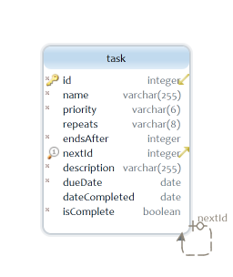

# MyTasks

[](https://travis-ci.org/Jonathan-S-Phillips/my-tasks)
[](https://coveralls.io/github/Jonathan-S-Phillips/my-tasks?branch=master)

MyTasks is a simple application meant to create and manage Tasks. Tasks are displayed in tables, separated by state (pending or complete), and can be filtered by name, description, priority, due date, and date completed (if complete). Pending tasks also have keyword filters and visual indicators for tasks over due (tasks with due date before todays date), tasks due today, and tasks due tomorrow. Tasks have a very simple repeating capability; they can repeat daily, weekly, monthly, or yearly.

The application is a full stack [TypeScript](https://www.typescriptlang.org/) app divided into an [Angular](https://angular.io/) client, [Express](https://github.com/expressjs/express) API server, and [SQLite](https://github.com/mapbox/node-sqlite3) database. See the [Built With](##built-with) section for more details on the client, server, and database. 

**Note on coverage: that is just server side coverage currently. I have not configured the angular-client with coveralls yet.

## Table of Contents

* [Getting Started](#getting-started)
* [Prerequisites](#prerequisites)
* [Build and Run](#build-and-run)
    * [Docker Compose Setup](#docker-compose-setup)
    * [Node Setup](#node-setup)
        * [Development Mode](#development-mode)
* [Accessing the App](#accessing-the-app)
* [Running the Tests](#running-the-tests)
    * [Unit Tests](#unit-tests)
    * [e2e Tests](#e2e-tests)
* [Documentation](#documentation)
* [Built With](#built-with)
* [Authors](#authors)
* [Acknowledgements](#acknowledgements)

## Getting Started

Run the following command to clone a copy of the repository into your current working directory.

```
git clone https://github.com/Jonathan-S-Phillips/my-tasks
```

In case you don't have GIT installed and configured on your machine a few helpful links are included below.

* [GIT](https://help.github.com/articles/set-up-git/) - Setup GIT
* [Clone Repo](https://help.github.com/articles/cloning-a-repository/) - Additional details on cloning GIT repo

### Prerequisites

In order to run the application you need to either have Docker Compose or Node installed and configured. Installing and configuring Docker Compose and Node are outside the scope of this document but a few helpful links are included below.

* [Docker Compose](https://docs.docker.com/compose/install/) - Install Docker Compose
* [Node](https://nodejs.org/en/) - Install Node

The app was built on Windows using the following setup:

* Docker version 18.06.0-ce-win70 (19075)
* Compose 1.22.0
* Node version 8.9.1
* NPM version 6.2.0 

### Build and Run

Once you have successfully cloned the repository you can build and run the MyTasks application one of the following two ways.

1. [Docker Compose Setup](#docker-compose-setup); or 
2. [Node Setup](#node-setup). 

#### Docker Compose Setup

If you have Docker Compose configured for your system, then you can use the following command from the root or base directory of the application to build and run both the server and client containers for the app.

```
docker-compose up --build
```

Thats it! The above command will initialize the full stack application with an empty database. The next time you start the app you may omit the "--build" option (unless you have made changes or update the node_modules). Any Tasks created and updated will be persisted if you restart the containers. Once the application is up and running you may access the client through a web browser at http://localhost:4200. More details on accessing the application and the API server are available [here](#accessing-the-app). 

It may take some time to setup and configure the containers depending on your connection speed. You may also see some warnings about npm packages, but they will not prevent the app from starting.

**Side Note: I did have to run the below command at some point when I was building the app to sync the time between my host machine and the containers because of time drift.

```
docker run --rm --privileged mytasks_angular-client hwclock -s
docker run --rm --privileged mytasks_server hwclock -s
```

#### Node Setup

If you have Node configured for your system, then you can use the npm scripts included at the root directory to build and run the application. You can build each part of the app separately, but I have included scripts at the root to run both the server and client together. The first step to build and run the application directly in your environment is to install dependencies. You can use the following command from the root of the application to install all required dependencies for both the client and server.

```
npm run install-all
```

If you are running npm version 6, then you will see a few vulnerabilities from the dependencies for the client. You can run the following command from the base of the client app to fix one of the vulnerabilities.

```
npm audit fix
```

The remaining fixes include breaking changes, which have not been tested.

Once the dependencies are installed you can use the following command (again from the root of the application) which will build and run both the client and server together.

```
npm start
```

Once the application is up and running you may access the client through a web browser at http://localhost:4200. More details on accessing the application and the API server are available [here](#accessing-the-app).

##### Development Mode

Continuing with the Node configuration, a script is included to start the application in development mode, which uses an in-memory version of the SQLite DB instead of persisting the DB to disk. The code is automatically set up to insert seed data from a JSON array into the DB when running the in-memory version. Run the following command to run the application in development mode.

```
npm run start:dev
```

All e2e tests use the in-memory version of the SQLite DB, and the unit tests use the same JSON array data inserted into the in-memory DB.

## Accessing the App

Once the application is up and running you may access the client through a web browser at http://localhost:4200. The server is setup to listen on port 3000 and the main Tasks API is available at http://localhost:3000/api/tasks.

## Running the Tests

The application has both unit and e2e tests. Currently the only way to run the tests is if you have Node configured. The client is using karma, and the server is using mocha and chai for unit tests. The e2e tests use protractor.

### Unit Tests

The unit tests for both the client and server can be run using the following command from the root of the application.

```
npm test
```

The server tests should run first followed by the client tests. A script is also included to generate coverage reports with the unit tests. Running the following command will run the unit tests and generate coverage reports as well.

```
npm run test:coverage
```

Separate coverage reports are generated for the client and the server using Istanbul Code Coverage. A coverage directory is added to both the client and server directories and the reports are added there. To view the reports browse to either the client or server, select the corresponding coverage directory, and open the index.html file found using your favorite browser.

### e2e Tests

The e2e tests can be run using the following command from the root of the application.

```
npm run e2e
```

This command will initialize the server and client, and execute the e2e tests against the app using the chrome browser. You may also run the e2e tests without a browser using the following command.

```
npm run e2e:headless
```

A third e2e test script is included which is meant to take screenshots of the application and various elements throughout the app for use in the AboutComponent of the app. The Microsoft Edge browser is the only browser that seems to work to take screenshots of individual elements, so the script uses Edge for the tests. To set up the Edge browser for e2e tests you must manually download the MicrosoftWebDriver, which is available [here](https://developer.microsoft.com/en-us/microsoft-edge/tools/webdriver/). Once you have downloaded the driver you must add it to the following angular-client directory.

```
 angular-client/node_modules/protractor/node_modules/webdriver-manager/selenium
```

**Note you may have to remove and re-add this file if you update the node_modules. Once you have your system set up with the Edge webriver, then you may run the following command to take screenshots while the e2e tests are running.

```
npm run e2e:screenshots
```

If you try to run the above command without setting up the Edge browser with protractor, then the script will fail. Also I have not tested this on a machine the does not already have Edge installed, so if you are running a machine that does not have Edge installed then you may run into issues.

## Documentation

Documentation for the client code and web API are included and available at the below URLs.

* [Angular Client](https://jonathan-s-phillips.github.io/my-tasks/angular-client/)
* [API](https://jonathan-s-phillips.github.io/my-tasks/server/)

Documentation for the client was built using [Compodoc](https://compodoc.app/) and documentation for the web API was built using [apiDoc](http://apidocjs.com/). Scripts are included to generate the documentation locally as well. You can run the following command which will update the docs directory with the latest changes from the source.

```
npm run doc
```

## Built With

The client is built using Angular 6, and leverages [Angular Material 2](https://material.angular.io/) for most of the UI components. The UI is designed to be responsive, and meant to work across a variety of devices. Breakpoints from the angular CDK layout (Handset and Small) are used to determine what features are available on the screen. Smaller screen sizes have only been emulated through chrome devtools and have not been fully tested though. 

The Express API server utilizes the [TypeORM](https://github.com/typeorm/typeorm) package to handle storing data in a SQLite database. The database only contains a single table for Tasks. To implement the repeating capability an optional one-to-one relationship is used to represent the relation from one Task to the next in the sequence, through the nextId property. A simple Entity Relationship (ER) diagram is included below



Below is a complete list of the technologies used to build the the app and links to their home or github pages.

* [TypeScript](https://www.typescriptlang.org/)
* [Angular](https://angular.io/) - UI Components
* [Angular Material 2](https://material.angular.io/) - Material Design components
* [Font-Awesome](https://github.com/FortAwesome/Font-Awesome) - Icons
* [Express](https://github.com/expressjs/express) - web framework
* [TypeORM](https://github.com/typeorm/typeorm) - ORM for TypeScript
* [SQLite](https://github.com/mapbox/node-sqlite3) - DB driver
* [Compodoc](https://compodoc.app/) - Angular project documentation
* [apiDoc](http://apidocjs.com/) - API documentation

## Authors

* **[Jonathan Phillips]** - (https://github.com/Jonathan-S-Phillips)

## Acknowledgments

Prior to developing this app I had only worked with Angular, so it was an exciting challenge to learn how to set up and configure an Express API server. I also enjoyed learning about Docker containers and how to use Compose to define and run a multi-container Docker app. Also even though I have worked with Angular before, I was using a mix of Typescript, jQuery, and the Bootstrap UI framework. For the purposes of this app I decided to go with a solution built entirely in TypeScript, which also gave me an opportunity to dive into Angular Material 2.
